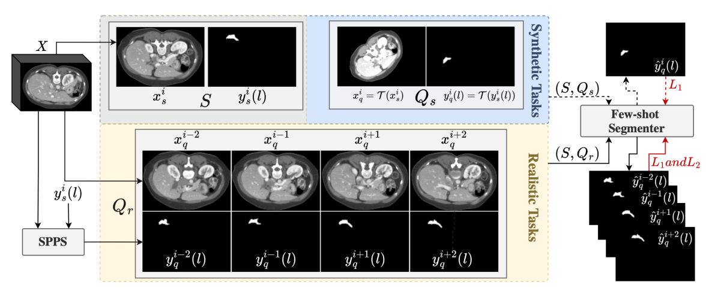

# VISA-FSS

  

[MICCAI'23]  [VISA-FSS: A Volume-Informed Self Supervised Approach for Few-Shot 3D Segmentation]

**Abstract**:
Few-shot segmentation (FSS) models have gained popularity in medical imaging analysis due to their ability to generalize well to unseen classes with only a small amount of annotated data. A key requirement for the success of FSS models is a diverse set of annotated classes as the base training tasks. This is a difficult condition to meet in the medical domain due to the lack of annotations, especially in volumetric images. To tackle this problem, self-supervised FSS methods for 3D images have been introduced. However, existing methods often ignore intra-volume information in 3D image segmentation, which can limit their performance. To address this issue, we propose a novel selfsupervised volume-aware FSS framework for 3D medical images, termed VISA-FSS. In general, VISA-FSS aims to learn continuous shape changes that exist among consecutive slices within a volumetric image to improve the performance of 3D medical segmentation. To achieve this goal, we introduce a volume-aware task generation method that utilizes consecutive slices within a 3D image to construct more varied and realistic self-supervised FSS tasks during training. In addition, to provide pseudolabels for consecutive slices, a novel strategy is proposed that propagates pseudo-labels of a slice to its adjacent slices using flow field vectors to preserve anatomical shape continuity. In the inference time, we then introduce a volumetric segmentation strategy to fully exploit the interslice information within volumetric images. Comprehensive experiments on two common medical benchmarks, including abdomen CT and MRI, demonstrate the effectiveness of our model over state-of-the-art methods. 

### 1. Dependencies
Please install essential dependencies (see `requirements.txt`)

### 2. Data pre-processing and superpixel generation
Data pre-processing and superpixel generation is the same as SSL-ALPNet paper. Follow the instructions in this [repository](https://github.com/cheng-01037/Self-supervised-Fewshot-Medical-Image-Segmentation)

### 4. Running training and evaluation

* Train the model (Stage 1): `./examples/train_visa_fss_<mri/ct>.sh`
* Finetune on multiple queries (Stage 2): `./examples/finetune_visa_fss_<mri/ct>.sh`
* Evalute the model performance: `./examples/val_vss1.sh` and `./examples/val_prop.sh`

### Acknowledgement
This code is based on [SSLALPNet](https://github.com/cheng-01037/Self-supervised-Fewshot-Medical-Image-Segmentation) (ECCV'20).